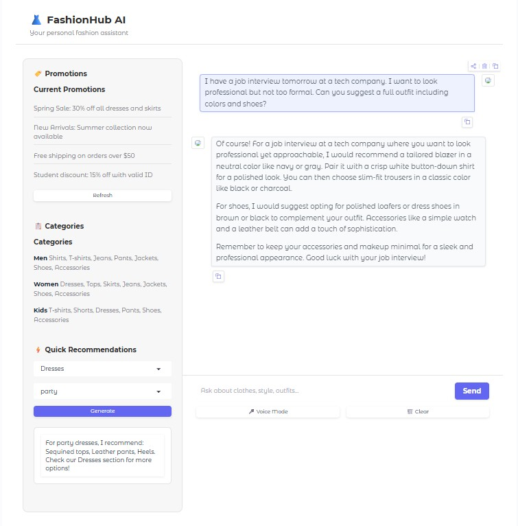
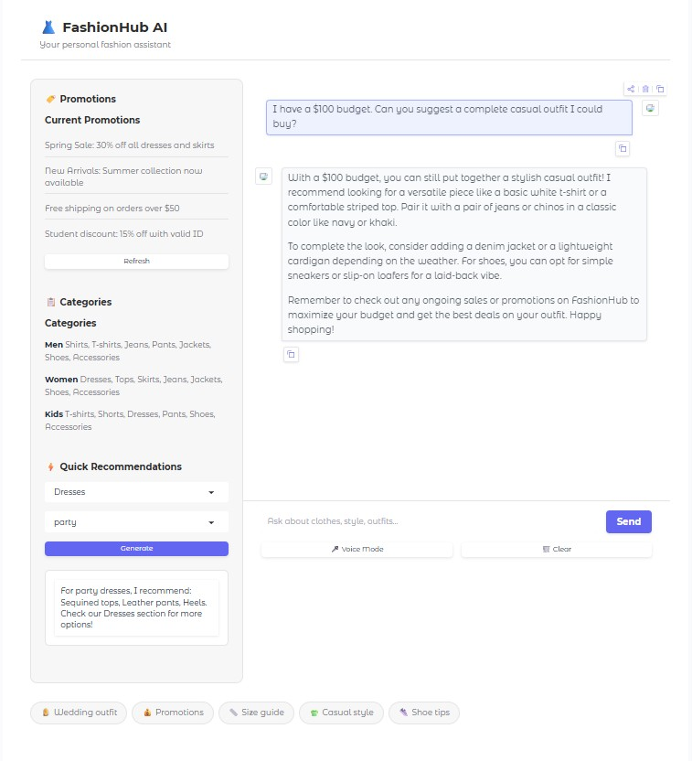

# 👗 FashionHub AI Shopping Assistant

An AI-powered clothes shopping chatbot that helps users discover outfits, get fashion advice, and interact using both **text and voice**.

This project demonstrates how AI can act as a **personal fashion stylist**, helping users find clothing, get recommendations, and explore promotions through an interactive interface.

---

# 🚀 Features

- 🤖 AI-powered shopping assistant
- 👗 Outfit recommendations based on occasion
- 🧥 Clothing category browsing
- 🎤 Voice chat support (speech-to-text)
- 🔊 AI voice responses (text-to-speech)
- 💬 Interactive chat interface
- 🏷️ Promotions and sales suggestions
- ⚡ Quick fashion recommendations

---

# 🖼 Demo

Example question:

```
I have a job interview tomorrow at a tech company.
What outfit would you recommend that looks professional but modern?
```

The AI assistant responds with a **complete outfit recommendation including clothing, colors, and accessories.**

---

# 🛠 Tech Stack

- Python
- OpenAI API
- Gradio (UI)
- Whisper (Speech-to-Text)
- Text-to-Speech API

---

# 📦 Installation

Clone the repository:

```bash
git clone https://github.com/NasirullahNasrat/FashionHub--AI-Shopping.git
cd FashionHub--AI-Shopping
```

Install dependencies:

```bash
pip install -r requirements.txt
```

---

# 🔑 Setup API Key

Create an API key from the OpenAI dashboard.

Set it as an environment variable:

### Windows

```bash
set OPENAI_API_KEY=your_api_key_here
```

### Mac / Linux

```bash
export OPENAI_API_KEY=your_api_key_here
```

---

# ▶️ Run the Application

Start the app:

```bash
python app.py
```

Then open in your browser:

```
http://localhost:7860
```

---

# 💬 Example Use Cases

- Get outfit ideas for events
- Ask for style advice
- Discover clothing categories
- Explore current promotions
- Use voice to interact with the AI stylist

---

# 📸 Screenshots

### Chat Interface


### Voice Chat Interaction


---

# 🔮 Future Improvements

- 🛍 Product database integration
- 🧾 Add-to-cart functionality
- 🧠 Personalized fashion recommendations
- 🌐 Deploy as a public website
- 📱 Mobile-friendly UI
- 🧥 AI outfit generator with images

---

# 🤝 Contributing

Contributions are welcome!

If you would like to improve the project, feel free to submit a pull request.

---

# 📄 License

This project is licensed under the MIT License.

---

# 👨‍💻 Author

Developed by **Nasirullah**

If you like this project, feel free to ⭐ the repository.
